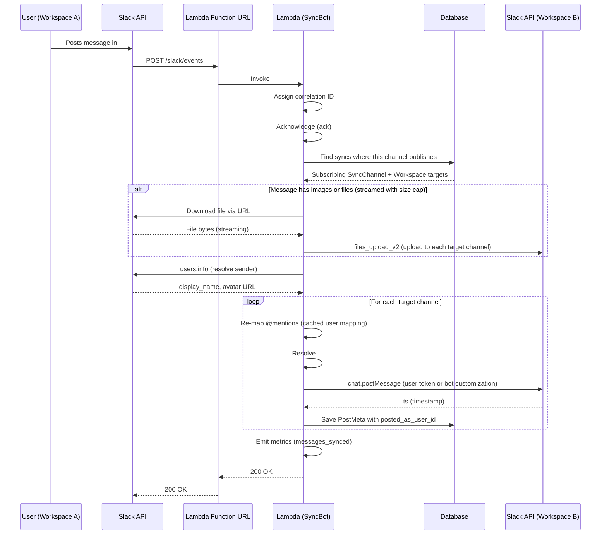
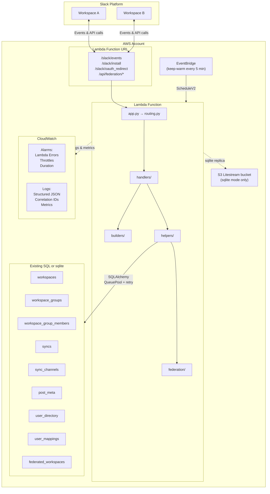
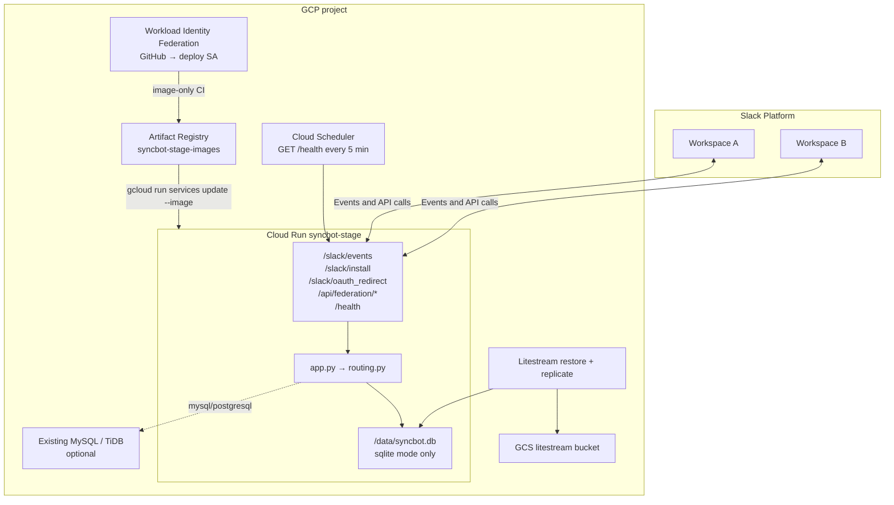

# Architecture

This page is how SyncBot is put together: the Python packages, the message-sync path, and the reference AWS and GCP layouts. For how to deploy, see [DEPLOY.md](DEPLOY.md).

## Module Overview

SyncBot is organized into six top-level packages inside `syncbot/`:

| Package | Responsibility |
|---------|----------------|
| `handlers/` | Slack event and action handlers (messages, groups, channel sync, users, tokens, federation UI, backup/restore, data migration) |
| `builders/` | Slack UI construction — Home tab, modals, and forms |
| `helpers/` | Business logic, Slack API wrappers, sync envelope/pipeline, PostMeta lookups, encryption, file handling, user mapping, caching, export/import (backup dump/restore, migration build/import) |
| `federation/` | Cross-instance sync — Ed25519 signing/verification, HTTP client, API endpoint handlers, pair payload (optional team_id/workspace_name for Instance A detection) (opt-in) |
| `db/` | SQLAlchemy engine, session management, `DbManager` CRUD helper, ORM models |
| `slack/` | Block Kit abstractions — action/callback ID constants, form definitions, ORM elements |

Top-level modules: `app.py` (entry point), `routing.py` (event dispatcher), `constants.py` (env-var names), `logger.py` (structured logging + metrics).

## Message Sync Flow

When a user posts in a channel that publishes, SyncBot builds one source-canonical envelope and sends it to every subscribing target discovered across that channel's active syncs. The envelope has `kind` (`message` or `reaction`) and a kind-specific `action` (`create`, `edit`, or `delete` for messages; `add` or `remove` for reactions). It also carries the people directory, source channel/workspace ids, and — for anything that belongs to an existing message — `thread_post_id` or that message's `post_id`. `run_sync_pipeline` is the shared discovery-and-apply path. Top-level creates fan out to every publish target. Follow-ups stay on the PostMeta records for that id, so a reply in a Channel that also publishes elsewhere cannot appear as a new top-level message in a sibling sync.

Each `SyncChannel` independently records whether it `publishes` and `subscribes`. An inbound Slack event may originate only from a publishing channel, and the pipeline applies it only to subscribing targets. Targets are deduplicated by workspace and channel. A synced copy is recognized through `post_meta` and never originates another envelope, so syncs do not create a second hop or a loop. This model also permits fan-in, where one local channel subscribes to several different published sources.

The same envelope path applies to edits (`chat.update`), deletes (`chat.delete`), thread replies (with `thread_ts` on the parent PostMeta records only), files, and reactions. A target with reaction type Off still receives the reaction envelope and skips apply for add and remove. Target message and file writes prefer the mapped person's user token and fall back to bot customization. `post_meta.posted_as_user_id` records which user token created a target post, so later edits and deletes use the same actor. Reactions use the mapped person's target-workspace user token when possible; Hybrid falls back to a bot thread notice only when that person has not authorized or their target token is invalid. Before that notice, SyncBot probes the target emoji name with the bot token when the target is in another Slack workspace (same-instance cross-workspace or federation inbound). Same-workspace targets skip the probe because they share an emoji catalog. Direct-only, Off, and a successful native add never probe. On Hybrid and Direct targets, unreact removes native reactions and deletes matching Hybrid notices (children first) via deterministic `rxn-` `post_id` rows in `post_meta` (`kind`, `parent_post_id`, `reaction`, `source_user_id`, `source_workspace_id`). A user deleting a notice on one target is a local tombstone only. Native reactions SyncBot applied with a user token emit a normal `reaction_added` / `reaction_removed` as that person; those echoes are remembered in `user_action_echoes` and skipped inside `run_claimed` before fan-out.

Slack delivers Events API payloads **at least once** (retries, queued cold starts). Message and reaction handlers claim Slack envelope ``event_id`` + ``team_id`` in ``processed_events`` before side effects: a duplicate delivery is a no-op; a failed attempt releases the claim so the retry can recover. User-token echo rows are separate from envelope ``event_id`` and are consumed when the matching inbound event is skipped. Local fixtures that omit ``event_id`` are processed without claiming.

Message bodies are taken from Block Kit when present. Slack ``event.text`` is a notification fallback: long app posts (Slackblast preblasts, Workflows) often arrive with newlines flattened to spaces and a truncated tail. The client **Show more** control is chrome on ``blocks``, not a second payload. SyncBot copies content blocks (``section``, ``header``, ``rich_text``, and similar), drops ``actions`` / ``input`` (those buttons belong to the source app), and skips ``file`` blocks that only have a source ``slack_file`` id. Link unfurls (Maps, and similar) are not copied as attachments; the target client rebuilds them from URLs in the text. Slack pastes a message as ``message_mention``; SyncBot converts that to a labeled ``link`` and keeps the source URL. Unlabeled permalinks get a ``message in #channel (Workspace)`` label; existing link text is left alone. Target posts set ``unfurl_links=false``. When a ``bot_message`` has no usable blocks, SyncBot loads the stored message with ``conversations.history``. Emoji in the body is copied as-is; target catalog probes are for reactions only.

For **federation**, the receiving instance applies the inbound envelope only when the addressed local channel subscribes. It resolves `@` mentions and `#` channel references locally before `chat.postMessage` / `chat.update`: mapped users become native `<@U>` tags, and `#` channel mentions become a code-ticked `#name (Workspace)` (never a target twin `<#C>`). Source message permalinks keep the source URL. Unlabeled permalinks get a ``message in #channel (Workspace)`` label; existing link text is left alone. This instance identifies itself with the SHA-256 hex fingerprint of its Ed25519 public key (64 characters), stored on `instance_keys`. Leftover `SYNCBOT_INSTANCE_ID` is ignored.

## AWS Infrastructure

How to deploy or update this stack (guided script, `sam`, GitHub Actions) is documented in **[DEPLOY.md](DEPLOY.md)**. The diagram below reflects the **reference** SAM template (`infra/aws/template.yaml`). The sequence diagram’s “Lambda Function URL” node is AWS-shaped; GCP uses Cloud Run with the same HTTP paths.

All of this AWS layout is defined in `infra/aws/template.yaml` (AWS SAM). **MySQL** is the default: public Lambda talks to a database you already created (TiDB Cloud, MySQL, Postgres, or RDS you own). **Sqlite** uses `/tmp/syncbot.db` plus Litestream to S3, with reserved concurrency 1. The stack does not create RDS or a VPC.

**Lambda cold start vs Slack acks:** The main function uses **256 MB** memory (faster init than 128 MB) and a **120 second** timeout so post-deploy `{"action":"migrate"}` can finish a cold start plus Alembic (Slack's 3s ack is unchanged). For **mysql** / **postgresql**, Alembic runs only on that migrate invoke, not on every Slack cold start. For **sqlite**, the wrapper restores from S3 and runs Alembic once per execution environment (then `litestream replicate`); a true cold start can miss Slack’s 3s window — keep-warm (`ENABLE_KEEP_WARM`) makes that rare; events still retry. EventBridge keep-warm ScheduleV2 invokes are handled in `app.handler` with a trivial JSON response instead of the Slack Bolt adapter.

## GCP Infrastructure

How to deploy this stack (guided script, Terraform, GitHub Actions) is in **[DEPLOY.md](DEPLOY.md)** and **[infra/gcp/README.md](../infra/gcp/README.md)**. The diagram matches the reference Terraform module in `infra/gcp`. The default **`database_backend` is `sqlite`**: Cloud Run scales to zero (`min_instances=0`) with a local SQLite file and a Litestream replica in GCS. **`mysql`** or **`postgresql`** is TiDB Cloud or other SQL (no GCS bucket). Cloud SQL is not created.

GitHub Actions never runs `terraform apply`. Image updates are CI-only; Terraform `lifecycle.ignore_changes` keeps the container image from being overwritten on later applies. Sqlite forces `max_instances=1` and concurrency 1. Keep-warm uses request-based billing (`cpu_idle=true`). Scale-to-zero (`min_instances=0`) relies on Slack retries; sync handlers are idempotent on `event_id`.

## Security & Hardening

| Layer | Protection |
|-------|------------|
| **Input** | File count caps (20), mention caps (50), federation user caps (5,000), federation body size limit (1 MB), `_sanitize_text` on form input |
| **Downloads** | Streaming with 30s timeout, 100 MB size cap, 8 KB chunks — prevents unbounded memory/disk usage |
| **Encryption** | Bot and user OAuth tokens encrypted at rest with Fernet (PBKDF2-derived key, cached to avoid repeated 600K iterations). Bolt `slack_installations` / `slack_bots` use `EncryptedSQLAlchemyInstallationStore`; compare decrypted plaintext when refreshing workspace bot tokens — never compare two Fernet ciphertexts. |
| **Database** | `pool_pre_ping=True` for stale connection detection, retry decorator on all operations, `dispose()` only after all retries exhausted |
| **Slack API** | `slack_retry` decorator with exponential backoff, `Retry-After` header support, user profile caching |
| **Network** | TLS to the existing SQL host when used, Lambda Function URL (IAM `NONE` auth type), federation HMAC-SHA256 signing with 5-minute replay window |
| **Authorization** | Slack admins/owners open Settings, Backup, Reset, and External Connections. Extra managers (a per-workspace Settings list) can configure groups and syncs. Leftover `REQUIRE_ADMIN` is ignored. The Home tab itself opens for everyone so any user can reach **Authorize SyncBot**, which records their own Slack user token (used to invite the bot into a private channel they belong to, and to write target messages, files, or native reactions as them — never another member's token, and never sent on federation payloads). DMs remain bot-authored. The section lists current user permissions in plain language and reappears if a later release asks for more, or if that person revokes their authorization in Slack (that person's installation row is deleted so Bolt can still authorize them with the workspace bot). Completing OAuth publishes that user's Home tab so the section disappears without a Refresh. **Refresh** sits in **SyncBot Configuration** directly under Authorize, for everyone. The install button always points at this instance's `/slack/install`; Slack's own authorize URL cannot set Bolt's state cookie |

## Performance & Cost (Home and User Mapping)

To keep database and Slack API usage low on Home and User Mapping:

- **Home content hash** — A minimal set of DB queries computes a hash of the data that drives Home (groups, members, syncs, pending invites, and whether that person has authorized SyncBot). If the hash matches the last full refresh, the app skips expensive work. Completing OAuth also publishes Home for that user (same `views.publish` path as a successful Refresh). For non-managers the hash is only that authorize payload, not groups and syncs, so a member clicking **Refresh** does not rebuild the whole workspace.
- **Cached Home blocks** — After a full refresh, the built Block Kit payload is cached under `home_tab_hash:{team_id}:{user_id}` / `home_tab_blocks:{team_id}:{user_id}`. When the hash matches, the app re-publishes that cached view with one `views.publish` instead of re-running all DB and Slack calls.
- **60-second Home cooldown** — If the user clicks Refresh again within 60 seconds and the hash is unchanged, the app re-publishes the cached view with a message: "No new data. Wait __ seconds before refreshing again."
- **Home push is acting user + invalidation** — `refresh_home_tab_for_workspace` invalidates the Home hash/blocks prefix for that Slack workspace, then (when `user_id` is set) publishes Home for that person only. It does **not** call `get_admin_ids` / `users.list` to fan out to every admin. Other people rebuild on the next `app_home_opened` or their own Refresh. Partner workspaces in the same group are invalidate-only unless the handler has a user on that workspace.
- **User Mapping is a modal** — Opening User Mapping `views.open`s the current DB mapping list only (no seed/map/crawl on the `trigger_id` path). Slack caps modals at 100 blocks, so the list paginates with Previous/Next (Block Kit has no scroll event, so the list cannot lazy-load on scroll). Mapping never replaces the Home tab with `views.publish`. **Auto Map Now** is a lazy job: cheap `views.update` to **Mapping users...**, seed from existing `user_directory` rows, map with `allow_slack_email_lookup=False` (no per-user Slack lookups), store `last_auto_map` on `workspace_settings`, then `views.update` the list and last-run line via `view_id`. **Refresh List** rebuilds from DB only and always restores Auto Map Now. An unmapped author on a synced message or reaction may be mapped on the fly by target directory email, then one `users.lookupByEmail` (`ensure_mapped_target_user_id`) without crawling `users.list`. Scheduled directory crawl / auto-map is future infra; group join seeds stubs only.
- **Request-scoped caching** — Within a single Lambda invocation, `get_workspace_by_id` (and DM helpers that still use `get_admin_ids`) can use the request `context` as a cache. Home push paths no longer depend on listing admins.
- **Bot identity** — `auth.test` (bot_id and the bot's member ID) is cached per bot token, not once for the process. A warm Lambda serves many workspaces; a shared identity made private-channel invites fail with `user_not_found`. Prefer Bolt's request-scoped `context["bot_user_id"]` when inviting SyncBot into a private Channel.

## Backup, Restore, and Data Migration

- **Full-instance backup** — Durable tables are dumped as plain JSON (no compression). Ephemeral Slack `event_id` claims (`processed_events`) and user-token echo rows (`user_action_echoes`) are omitted. Bolt user and bot tokens in the dump are ciphertext when encryption is on; restore needs the same `DATA_ENCRYPTION_KEY`. The payload includes `version`, `exported_at`, `encryption_key_hash` (SHA-256 of `DATA_ENCRYPTION_KEY`), and `hmac` (HMAC-SHA256 over canonical JSON). Restore inserts rows in FK order; it is intended for an empty or fresh database (e.g. after an AWS rebuild). On HMAC or encryption-key mismatch, the UI warns but allows proceeding. After restore, Home tab caches (`home_tab_hash`, `home_tab_blocks`) are invalidated for all restored workspaces.
- **Data migration (workspace-scoped)** — Export produces a JSON file with syncs, sync channels, post meta, user directory, and user mappings keyed by stable identifiers (team_id, sync title, channel_id). The export can include `source_instance` (webhook_url, instance_id, public_key, one-time connection code) so import on the new instance can establish the federation connection and then import in one step. The payload is signed with the instance Ed25519 key; import verifies the signature and warns (but does not block) on mismatch. Import uses replace mode: existing SyncChannels and PostMeta for that workspace in the federated group are removed, then data from the file is created. User mappings are imported where both source and target workspace exist on the new instance. After import, Home tab caches for that workspace are invalidated.
- **Instance A detection** — When instance B connects to A via federation, B can send optional `team_id` and `workspace_name` in the pair request. A stores them on the `federated_workspaces` row (`primary_team_id`, `primary_workspace_name`) and, if a local workspace with that `team_id` exists, soft-deletes it so the only representation of that workspace on A is the federated connection.
