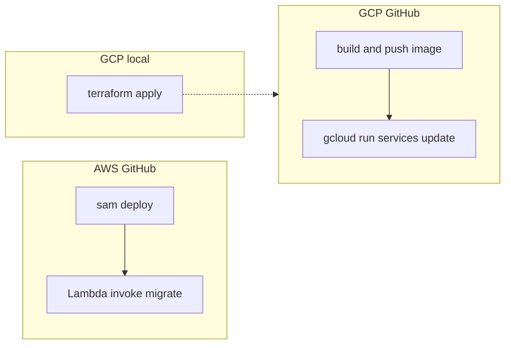

# Deployment Guide

If this is your first install, start with the root [README](../README.md). That walkthrough is Slack app → env file → deploy script → update Slack URLs. This page is the rest of the story: GitHub Actions, manual SAM and Terraform, upgrades, and the knobs the quickstart leaves out.

Runtime environment variables are listed in [INFRA_CONTRACT.md](INFRA_CONTRACT.md). Keep **Python 3.12** aligned across `pyproject.toml`, `syncbot/requirements.txt`, Lambda or Cloud Run, and CI.

> **Which env file?** `.env.example` is for **local** development (`cp .env.example .env`; see [DEVELOPMENT.md](DEVELOPMENT.md)). `.env.deploy.example` is for **cloud** (`cp .env.deploy.example .env.deploy.test`, then `./deploy.sh --env test`).



On AWS, GitHub Actions runs `sam deploy` and then invokes Lambda to migrate. On GCP, GitHub only builds and pushes a container image. Secrets, the database backend, and Cloud Run warmth change only when you run `terraform apply` locally.

---

## Deploy script

From the **repository root**:
  - On **macOS / Linux**, run `./deploy.sh`.
  - On **Windows**, run `.\deploy.ps1`.

**Interactive:** `./deploy.sh` with no `--env` flag prompts for stage (`test` or `prod`), loads that env file, then shows the provider task menu (build, CI/CD, Slack API). On AWS, the script creates or syncs the bootstrap stack before that menu.

**Non-interactive:** `./deploy.sh --env test` or `./deploy.sh --env prod`. Copy values from `.env.deploy.example`. The launcher reads `.env.deploy.test` or `.env.deploy.prod` and runs `infra/<CLOUD_PROVIDER>/scripts/deploy.sh`. Set **`CLOUD_PROVIDER=aws`** or **`gcp`** in that file. There is no `aws` or `gcp` argument on the command line.

**Bootstrap (AWS):** The first `./deploy.sh --env test` creates the bootstrap CloudFormation stack if it is missing. Later deploys skip CloudFormation when `template.bootstrap.yaml` is unchanged (the hash is stored as stack parameter `TemplateContentSha256`). Pass `--bootstrap` to force a sync even when the hash matches. GCP has no separate bootstrap stack (`terraform apply` is the whole stack), so `--bootstrap` is ignored there.

**GitHub setup:** Add `--setup-github` after a local deploy to copy config into GitHub (`./deploy.sh --env test --setup-github`). On AWS, it pushes uncommented non-empty env-file keys that AWS CI actually reads (including `PRIMARY_WORKSPACE`, federation, TLS, and `ENABLE_DB_RESET` when you set them). On GCP, it only writes repo Workload Identity Federation vars and `GITHUB_DEPLOY_TARGET`. You still **redeploy** (local `./deploy.sh` or a push to `test`/`prod`) for Lambda to pick up new app settings. GitHub cannot create the first AWS bootstrap stack and never runs GCP `terraform apply`.

Set **`GITHUB_REPO=YOUR_GITHUB_OWNER/YOUR_REPO`** in `.env.deploy.test` or `.env.deploy.prod` (or export it) to skip the prompt when both a fork and upstream remote exist. That value stays local; the script does not push it as a GitHub variable.

**Verbose output:** Add `--verbose` for a longer deploy receipt (SAM or Terraform parameters, and an inline Slack manifest) and extra screen output. Example: `./deploy.sh --env test --verbose`.

**Force `update-stack` (AWS):** Set `AWS_UPDATE_STACK=true` in the env file, or pass **`--update-stack`**, to skip `sam deploy` and call CloudFormation `update-stack` directly. You usually do not need this; the AWS script already retries after an `EarlyValidation::ResourceExistenceCheck` changeset failure.

**Secret auto-generation:** If `DATA_ENCRYPTION_KEY` is empty, the script generates a key and saves it back to the `.env.deploy` file. `DATABASE_USER` and `DATABASE_PASSWORD` are never generated for you — create the SQL user first (see [Create the database and app user](#create-the-database-and-app-user)).

**Interactive save:** After a successful interactive deploy, the script asks whether to save the config to `.env.deploy.test` or `.env.deploy.prod` for the next non-interactive run.

**Windows:** `deploy.ps1` needs **Git Bash** or **WSL** with bash, then runs the same `infra/.../deploy.sh` as macOS and Linux. You can also install [Git for Windows](https://git-scm.com/download/win) or [WSL](https://learn.microsoft.com/windows/wsl/install) and run `./deploy.sh` from Git Bash or a WSL shell.

**Prerequisites** (short list in the root [README](../README.md); more detail below):

- **AWS:** AWS CLI v2, SAM CLI, Python 3 (`python3`), **`curl`** (for the Slack manifest API), and an **active AWS CLI session**. Docker is no longer needed: the Lambda build runs on your machine and asks pip for the runtime's wheels, so the artifact is the same whether you build on macOS, Linux, arm64, or x86_64. **Optional:** `gh` for GitHub Actions setup. The script prints a status line per tool (✓ / !) and Slack doc links. If `gh` is missing, it asks whether to continue. A missing cloud login fails immediately; the script does not open a login prompt.
- **GCP:** Terraform, `gcloud`, Python 3, **`curl`**, an **active `gcloud` login**, and Application Default Credentials. **Optional:** `gh`, with the same behavior as AWS.

**Slack install error `invalid_scope` / “Invalid permissions requested”:** The OAuth authorize URL is built from **`SLACK_BOT_SCOPES`** and **`SLACK_USER_SCOPES`** in your deployed app (Lambda / Cloud Run). They must **exactly match** the scopes on your Slack app (`slack-manifest.json` → **OAuth & Permissions** after manifest update) and `BOT_SCOPES` / `USER_SCOPES` in `syncbot/slack_manifest_scopes.py`. SAM and GCP Terraform defaults include both bot and user scope strings; if your environment has **stale** overrides, redeploy with parameters matching the manifest or update the Slack app to match. On GCP, `slack_user_scopes` must stay aligned with `oauth_config.scopes.user`. **Renames (older stacks):** `SLACK_SCOPES` → `SLACK_BOT_SCOPES`; SAM `SlackOauthScopes` → `SlackOauthBotScopes`; SAM `SlackUserOauthScopes` → `SlackOauthUserScopes` (`SLACK_USER_SCOPES` unchanged).

---

## What the deploy scripts do

### Root: `deploy.sh` / `deploy.ps1`

- Loads `.env.deploy.<stage>` and runs `infra/<CLOUD_PROVIDER>/scripts/deploy.sh`.
- **`./deploy.sh` (macOS / Linux):** Invokes `bash` with the chosen `infra/<provider>/scripts/deploy.sh`.
- **`.\deploy.ps1` (Windows):** Verifies **Git Bash** or **WSL** bash is available (shows which one will be used), then runs the same `deploy.sh` path. There are **no** `deploy.ps1` files under `infra/` — only the repo-root launcher uses PowerShell. Provider prerequisite checks (AWS/GCP tools, optional `gh`, Slack links) run **inside** the bash `deploy.sh` scripts.

### AWS: `infra/aws/scripts/deploy.sh`

Runs from repo root (or `./deploy.sh --env test` with `CLOUD_PROVIDER=aws`). It:

1. **Prerequisites** — Verifies `aws`, `sam`, `python3`, `curl` are on `PATH` (with install hints). Prints a status matrix; if optional `gh` is missing, shows install hints and asks whether to continue. Prints Slack app / API token / manifest API links. **Fails immediately** if there is no active AWS CLI session (`aws sts get-caller-identity`); log in with `aws login`, `aws sso login`, or `aws configure` and rerun. The script does not open a login prompt.
2. **Bootstrap** — Creates the bootstrap stack if it is missing, and syncs it when `template.bootstrap.yaml` has changed (or when you passed `--bootstrap`). Set `SYNCBOT_SKIP_BOOTSTRAP_SYNC=1` to create-if-missing only.
3. **App stack identity** — Prompts for stage (`test`/`prod`) and stack name; detects an existing CloudFormation stack for update.
4. **Deploy Tasks** — Multi-select menu (comma-separated, default all): **Build/Deploy** (full config + SAM), **CI/CD** (`gh` / GitHub Actions), **Slack API**. Omitting **Build/Deploy** requires an existing stack for tasks that need live outputs.
5. **Configuration** (if Build/Deploy selected) — then **SAM build** (`--build-in-source`) and `sam deploy`. If the live stack still has stack-managed RDS, deploy **aborts** (see [Upgrading AWS](#upgrading-aws-stack-managed-rds-removal)).

   | Knob | Behavior |
   |------|----------|
   | Backend | **`DATABASE_BACKEND`:** `mysql` (default: TiDB / MySQL / your own public RDS), `postgresql`, or `sqlite` (Litestream → S3, `/tmp/syncbot.db`, reserved concurrency 1). Do not infer this from `DATABASE_HOST`. |
   | Secrets | `DATA_ENCRYPTION_KEY` and `DATABASE_PASSWORD` are SAM **NoEcho**. **`DatabaseUser` is not NoEcho**. Slack signing and client secrets are NoEcho. |
   | Remote SQL | Create the database and user first. Use the full `DATABASE_USER` (including any TiDB prefix). The host must be public (no VPC). Leave the port blank for the engine default; TiDB Cloud often uses **4000**. Name the database `syncbot_test` or `syncbot_prod`. |
   | Keep-warm | `ENABLE_KEEP_WARM` defaults on (EventBridge ScheduleV2 invoke — not HTTP `/health`) |
   | Abort | Leftover `RDSInstance*` stops the deploy; there is no `--force` |

6. **Post-deploy** — stack outputs, `slack-manifest_test.json` or `slack-manifest_prod.json`, Slack API, optional **`gh`**, and a receipt under `deploy-receipts/` (gitignored). The receipt has config, secrets, and Slack **Event**, **Interactivity**, **Redirect**, and **Install** URLs. Those Slack URLs are the public origin SyncBot uses for OAuth install and federation (the app reads the Host of incoming Slack requests). Paste the generated manifest into the Slack app so event subscriptions stay in sync (including `app_uninstalled` and `tokens_revoked`). `--verbose` adds SAM parameters and an inline manifest.

### GCP: `infra/gcp/scripts/deploy.sh`

Runs from repo root (or `./deploy.sh --env test` with `CLOUD_PROVIDER=gcp`). It:

1. **Prerequisites** — Verifies **Terraform**, **gcloud**, **python3**, **curl**; optional **gh** handling (same as AWS). **Fails immediately** if there is no active `gcloud` user login or Application Default Credentials; run `gcloud auth login` and `gcloud auth application-default login`, then rerun. The script does not open a login prompt.
2. **Project / stage / existing service** — Prompts for project, region, stage; can detect existing Cloud Run for defaults.
3. **Deploy Tasks** — Multi-select menu (comma-separated, default all): **Build/Deploy** (full Terraform flow), **CI/CD**, **Slack API**. Skipping **Build/Deploy** requires existing Terraform state/outputs for tasks that need them.
4. **Secrets** (if Build/Deploy is selected) — Prompts for `SLACK_SIGNING_SECRET`, `SLACK_CLIENT_ID`, `SLACK_CLIENT_SECRET`, and `DATA_ENCRYPTION_KEY`. `DATABASE_PASSWORD` and `DATABASE_USER` only when `DATABASE_BACKEND` is mysql or postgresql. Passed as sensitive Terraform variables. Image-only GitHub Actions does not need these in GitHub secrets.
5. **Terraform** (if Build/Deploy is selected) — Choose **SQLite + Litestream** (default) or a MySQL/PostgreSQL host, Cloud Run warmth (`GCP_CLOUD_RUN_MIN_INSTANCES` default **0**, keep-warm default on), optional `GCP_CLOUD_RUN_IMAGE` (blank uses the hello placeholder; CI replaces it), and log level. Then `terraform init` / `plan` / `apply` in `infra/gcp`. Confirm the plan does **not** create Cloud SQL.
6. **Post-deploy** — According to selected tasks: manifest, Slack API, deploy receipt, **`gh`**, `print-bootstrap-outputs.sh`. The receipt includes all configuration, secrets, and Slack URLs. Use `--verbose` to also include the full Terraform variables array and inline Slack manifest.

See [infra/gcp/README.md](../infra/gcp/README.md) for Terraform variables and outputs.

---

## Fork-first model (recommended for forks)

The **upstream** repo ([F3Nation-Community/slack-syncbot](https://github.com/F3Nation-Community/slack-syncbot)) is the shared codebase. Your **fork** is what you deploy. Use **`main`** to track upstream and merge contributions. On the fork, use **`test`** and **`prod`** for automated deploys (workflows run on push to those branches). Canonical releases are produced on F3Nation-Community `main` only — do not run a second semantic-release on the fork. More on branching is in [CONTRIBUTING.md](../CONTRIBUTING.md).

1. Keep `syncbot/` provider-neutral; use only env vars from [INFRA_CONTRACT.md](INFRA_CONTRACT.md).
2. Put provider code in `infra/<provider>/` and `.github/workflows/deploy-<provider>.yml`.
3. Prefer the AWS layout as reference; treat other providers as swappable scaffolds.

---

## Provider selection (CI)

| Provider | Infra | CI workflow | Default |
|----------|-------|-------------|---------|
| **AWS** | `infra/aws/` | `.github/workflows/deploy-aws.yml` | Yes |
| **GCP** | `infra/gcp/` | `.github/workflows/deploy-gcp.yml` | Opt-in |

- **AWS only:** Do not set `GITHUB_DEPLOY_TARGET=gcp` (or set it to something other than `gcp`).
- **GCP only:** Set repository variable **`GITHUB_DEPLOY_TARGET`** = **`gcp`**, complete GCP bootstrap + WIF, and disable or skip the AWS workflow so only `deploy-gcp.yml` runs.

---

## Environment variable reference

Every deploy and runtime variable, grouped the same way as [.env.deploy.example](../.env.deploy.example). Each one can live in your local `.env.deploy.<stage>` file and/or as a GitHub Actions **variable** — except the ones marked **secret**, which must be GitHub Actions **secrets** (never variables, never committed). Runtime behavior for each name is in [INFRA_CONTRACT.md](INFRA_CONTRACT.md); this table is about where deploy and CI read them.

Only fill the provider block that matches `CLOUD_PROVIDER`, and only fill the database rows that match `DATABASE_BACKEND`.

### Slack app

| Variable | Notes |
|----------|-------|
| `SLACK_CLIENT_ID` | Required. Slack **Basic Information → App Credentials**. |
| `SLACK_CLIENT_SECRET` | Required. **Secret.** |
| `SLACK_SIGNING_SECRET` | Required. **Secret.** |
| `SLACK_BOT_SCOPES` | Optional. Comma-separated bot scopes. SAM and Terraform already default to `BOT_SCOPES` in `syncbot/slack_manifest_scopes.py`; set this only to override, and it must match the Slack app or install fails with `invalid_scope`. |
| `SLACK_USER_SCOPES` | Optional. Comma-separated user scopes; defaults to `USER_SCOPES`. Same matching rule. |

### Provider selection

| Variable | Notes |
|----------|-------|
| `CLOUD_PROVIDER` | Required in `.env.deploy.<stage>`. `aws` or `gcp`; selects `infra/<provider>/scripts/deploy.sh`. Not read by CI. |
| `GITHUB_DEPLOY_TARGET` | GitHub variable. `gcp` runs Deploy (GCP) and skips Deploy (AWS); unset or anything else means AWS. |
| `GITHUB_REPO` | Optional, **local only**. `YOUR_GITHUB_OWNER/YOUR_REPO` to skip the remote prompt during `--setup-github`. Never pushed to GitHub. |

### AWS

| Variable | Notes |
|----------|-------|
| `AWS_REGION` | Required as a GitHub variable for CI. Local default `us-east-1`. |
| `AWS_STACK_NAME` | CloudFormation app stack. Convention `syncbot-test` / `syncbot-prod`. Empty in CI → the job's `syncbot-<stage>`. |
| `AWS_BOOTSTRAP_STACK_NAME` | Repo-level. Default `syncbot-bootstrap`. What CI passes to `ensure_bootstrap.sh`. |
| `AWS_ROLE_TO_ASSUME` | GitHub variable (OIDC). Bootstrap output `GitHubDeployRoleArn`. Written by `--setup-github`; not needed in the env file. |
| `AWS_S3_BUCKET` | GitHub variable. Bootstrap `DeploymentBucketName` (SAM artifact bucket). Empty in CI → described from the bootstrap stack. |
| `AWS_ENABLE_XRAY` | Optional. `true` / `false` (default `false`). X-Ray tracing costs money. |
| `AWS_UPDATE_STACK` | Optional. `true` forces CloudFormation `update-stack` instead of `sam deploy` (same as `--update-stack`). Rarely needed. |
| `ENABLE_KEEP_WARM` | Portable name (also GCP). `true` (default) / `false`. AWS EventBridge ScheduleV2 invoke every 5 minutes. |

### GCP

| Variable | Notes |
|----------|-------|
| `GCP_PROJECT_ID` | Required. Globally unique GCP project ID (not `syncbot-test`; the Cloud Run **service** is `syncbot-<stage>`). |
| `GCP_REGION` | Terraform default if unset is `us-central1`. |
| `GCP_SERVICE_ACCOUNT` | GitHub variable (CI). Deploy service-account email from Terraform output. |
| `GCP_WORKLOAD_IDENTITY_PROVIDER` | GitHub variable (CI). Full WIF provider resource name from Terraform output. |
| `GCP_CLOUD_RUN_IMAGE` | Optional, **local Terraform only**. Blank = `gcr.io/cloudrun/hello`; CI replaces it. |
| `GCP_CLOUD_RUN_MIN_INSTANCES` | `0` (default, free scale-to-zero) or `1` (paid always-on). |
| `ENABLE_KEEP_WARM` | Portable name (also AWS). `true` (default) / `false`. GCP Cloud Scheduler `GET /health`. |

### Database

| Variable | Notes |
|----------|-------|
| `DATABASE_BACKEND` | `mysql` (AWS default), `postgresql`, or `sqlite` (GCP default). Do not infer from `DATABASE_HOST`. |
| `DATABASE_HOST` | Required for mysql/postgresql. Unused for sqlite. |
| `DATABASE_PORT` | Optional. Empty = engine default (3306 MySQL, 5432 PostgreSQL); TiDB Cloud uses 4000. |
| `DATABASE_USER` | Required for mysql/postgresql. GitHub **variable**, not a secret. Full username including any TiDB cluster prefix. |
| `DATABASE_PASSWORD` | Required for mysql/postgresql. **Secret.** Unused for sqlite. |
| `DATABASE_SCHEMA` | Database name. Convention `syncbot_test` / `syncbot_prod`. Empty in CI → reuse the live stack parameter, or infer on a new stack. Unused for sqlite. |
| `DATABASE_TLS_ENABLED` | Optional. `true` (default outside local) / `false`. |
| `DATABASE_SSL_CA_PATH` | Optional. CA bundle path; unset uses the system trust store. |

### Data encryption

| Variable | Notes |
|----------|-------|
| `DATA_ENCRYPTION_KEY` | Required. **Secret.** Auto-generated and saved back if empty on a local deploy. Back it up — if you lose it, every workspace must reinstall. |

### Optional app settings

| Variable | Notes |
|----------|-------|
| `LOG_LEVEL` | `DEBUG`, `INFO`, `WARNING`, `ERROR`, or `CRITICAL` (default `INFO`). At DEBUG, logs include `sync.*` traces for message skip, pipeline fan-out, and file share timestamps. |
| `PRIMARY_WORKSPACE` | Slack Team ID that unlocks Backup/Restore (and scopes DB reset). Takes effect after a redeploy. |
| `ENABLE_DB_RESET` | `true` / `false` (default `false`). Shows the Reset Database button, and only on the primary workspace. |

How long uninstalled workspace data is kept, whether federation is on, and which workspaces may publish a Broadcast are set in **Settings** on the primary workspace. Extra managers and whether private Channels may be published are per-workspace Settings on every installed workspace. Those are not environment variables. This instance's federation id is derived from its Ed25519 public key; you do not pin a UUID at deploy time.

Leftover deploy env such as `REQUIRE_ADMIN`, `SYNCBOT_FEDERATION_ENABLED`, `SYNCBOT_PUBLIC_URL`, and `SYNCBOT_INSTANCE_ID` is no longer set by SAM or Terraform. If an old process still has them, the app logs a warning and ignores them — federation belongs in **Settings**, and the instance id is a fingerprint of the signing key.

---

## Database backends

The app supports **MySQL**, **PostgreSQL**, and **SQLite**. Set **`DATABASE_BACKEND`** to `mysql`, `postgresql`, or `sqlite`. Schema changes use Alembic (`alembic upgrade head`). The app does **not** run `CREATE DATABASE` or create users — do that first (recipes below). Do **not** infer the backend from `DATABASE_HOST`.

| | AWS | GCP |
|-|-----|-----|
| Default database | MySQL that you create (TiDB Cloud is a common host). PostgreSQL works too. | SQLite, with Litestream replicating to GCS. No SQL user. |
| Other option | `DATABASE_BACKEND=sqlite` (Litestream to S3) | `DATABASE_BACKEND=mysql` or `postgresql` (same SQL-user steps as AWS) |

On **AWS Lambda**, mysql and postgresql run Alembic after each deploy via `{"action":"migrate"}` (not on every Slack cold start). Sqlite restores from S3, runs Alembic once per execution environment, then replicates; keep the post-deploy migrate invoke. On **Cloud Run** and **local**, migrations run at process startup before the app serves HTTP. This template does **not** create RDS, a VPC, or Cloud SQL. Empty `DATABASE_PORT` uses the engine default (**3306** MySQL, **5432** PostgreSQL) on both AWS and GCP.

The runtime names are in [INFRA_CONTRACT.md](INFRA_CONTRACT.md): `DATABASE_BACKEND`, plus `DATABASE_URL` or host / user / password / schema.

### Create the database and app user

Create the database and a least-privilege user **before** the first migrate. Stage is only `test` or `prod`. Name the database `syncbot_test` or `syncbot_prod` so it matches `DATABASE_SCHEMA` (the convention is `syncbot_` plus the stage).

**MySQL / TiDB Cloud** — `DATABASE_USER` must be the **full** username (TiDB Cloud Serverless includes a cluster prefix, for example `abc123.syncbot_app`):

```sql
CREATE DATABASE IF NOT EXISTS syncbot_test;
CREATE USER 'YOUR_FULL_USERNAME'@'%' IDENTIFIED BY 'a-strong-password';
GRANT ALL ON syncbot_test.* TO 'YOUR_FULL_USERNAME'@'%';
FLUSH PRIVILEGES;
```

Use `syncbot_prod` in the same way for production.

**PostgreSQL:**

```sql
CREATE DATABASE syncbot_test;
CREATE USER syncbot_app WITH PASSWORD 'a-strong-password';
GRANT ALL PRIVILEGES ON DATABASE syncbot_test TO syncbot_app;
\c syncbot_test
GRANT ALL ON SCHEMA public TO syncbot_app;
```

Then set `DATABASE_BACKEND=mysql` (or `postgresql`), `DATABASE_HOST`, `DATABASE_USER`, `DATABASE_PASSWORD`, and `DATABASE_SCHEMA`. Sqlite does not need a SQL user.

### Upgrading AWS (stack-managed RDS removal)

If `./deploy.sh` or GitHub Actions **aborts** because the CloudFormation stack still contains `RDSInstanceMysql` / `RDSInstancePostgres`, do **not** retry the same update. There is no in-place migrate from stack RDS to TiDB or sqlite.

1. While the old stack is still serving Slack, open Home → **Backup/Restore** and download JSON (`PRIMARY_WORKSPACE` required). Keep the same `DATA_ENCRYPTION_KEY` for the new stack. See [BACKUP_AND_MIGRATION.md](BACKUP_AND_MIGRATION.md).
2. Delete the CloudFormation **app** stack. RDS `DeletionProtection` may block `delete-stack` until you disable protection or delete the instance in the RDS console — do that **manually** after the backup. Deploy scripts will not disable protection.
3. Deploy a **new** stack with `DATABASE_BACKEND=mysql` (TiDB / your own host) or `sqlite`. Point Slack at the new Function URL / generated manifest.
4. Restore the backup JSON onto the empty new database.

Stacks that already use a public existing host (TiDB) update in place: set the full `DATABASE_USER` (and password/host) in `.env.deploy.*` and GitHub environment variables **before** this template update, then deploy.

---

## AWS — manual steps (no helper script)

Use this when you already know SAM/CloudFormation or are debugging.

### 1. One-time bootstrap

**Prerequisites:** AWS CLI, SAM CLI (for later app deploy).

```bash
aws cloudformation deploy \
  --template-file infra/aws/template.bootstrap.yaml \
  --stack-name YOUR_BOOTSTRAP_STACK \
  --parameter-overrides \
    GitHubRepository=YOUR_GITHUB_OWNER/YOUR_REPO \
  --capabilities CAPABILITY_NAMED_IAM \
  --region YOUR_AWS_REGION
```

Optional: `CreateOIDCProvider=false` if the GitHub OIDC provider already exists. Stack name convention is `syncbot-bootstrap` for bootstrap and `syncbot-test` or `syncbot-prod` for the app stack.

**Outputs:**

```bash
./infra/aws/scripts/print-bootstrap-outputs.sh
```

Map **GitHubDeployRoleArn** → `AWS_ROLE_TO_ASSUME`, **DeploymentBucketName** → `AWS_S3_BUCKET`, **BootstrapRegion** → `AWS_REGION`.

### 2. Build and deploy the app stack

```bash
sam build -t infra/aws/template.yaml --build-in-source
sam deploy \
  -t .aws-sam/build/template.yaml \
  --stack-name YOUR_STACK_NAME \
  --s3-bucket YOUR_DEPLOYMENT_BUCKET_NAME \
  --capabilities CAPABILITY_IAM \
  --region YOUR_AWS_REGION \
  --parameter-overrides \
    SlackSigningSecret=... \
    SlackClientID=... \
    SlackClientSecret=... \
    SlackOauthBotScopes=... \
    SlackOauthUserScopes=... \
    DatabaseBackend=mysql \
    DatabaseSchema=syncbot_test \
    DatabaseHost=YOUR_DATABASE_HOST \
    DatabaseUser=... \
    DatabasePassword=... \
    EnableKeepWarm=true
```

**`--build-in-source` is required, and `--use-container` will not work.** The function's `CodeUri` is `infra/aws/lambda/`, but its `Makefile` copies the application from `syncbot/` at the repo root. SAM normally runs that Makefile from a scratch copy of `CodeUri` (inside a container, that is all it mounts), so the repo root is not reachable and the build fails with `cp: cannot stat '.../syncbot/.'`. Building in source runs the Makefile where it lives, so the relative path resolves. The `test` and `prod` profiles in [`samconfig.toml`](../samconfig.toml) already set `build_in_source`.

Because the build no longer runs in a Lambda container, the Makefile asks pip for the runtime's wheels explicitly (CPython 3.12, `manylinux` x86_64) instead of the build host's. That is what keeps a macOS or arm64 laptop from producing an artifact that imports fine locally and then fails on every invocation in Lambda.

Use **`sam deploy --guided`** the first time if you prefer prompts. Set `Stage` to `test` or `prod` (the [`samconfig.toml`](../samconfig.toml) profiles already do that). For **mysql** or **postgresql** set `DatabaseBackend`, `DatabaseHost`, `DatabaseUser`, `DatabasePassword`, and optional `DatabasePort` (empty uses the engine default; TiDB Cloud often uses **4000**). For **sqlite** set `DatabaseBackend=sqlite` (no host, user, or password). An empty `DatabaseHost` does **not** create RDS.

**`DatabaseSchema` naming:** Use `syncbot_test` or `syncbot_prod` so environments can share one host. The app uses this name exactly; it does **not** append the stage. Match grants for your app user.

**samconfig:** [`samconfig.toml`](../samconfig.toml) has `test` / `prod` profiles with `Stage` only — pass other parameters via `--parameter-overrides` or the guided script. (CLI config, not a copy-paste guide.)

**Secrets (SAM / CloudFormation):** `DATA_ENCRYPTION_KEY` and `DATABASE_PASSWORD` have `NoEcho: true`. **`DatabaseUser` does not** (it is a CloudFormation parameter, visible in the console). Slack signing secret and client secret are NoEcho. User and password are unused for sqlite. The deploy script generates `DATA_ENCRYPTION_KEY` if empty and saves it back to `.env.deploy`. Back it up — if you lose it, all workspaces must reinstall. Create the SQL user yourself; the stack does not create credentials.

**GitHub Actions:** `DATABASE_USER` is a **repository environment variable** (not a secret)—set it to the same value as in your local `.env.deploy.<stage>` so CI matches your deploy file.

**CloudWatch Logs:** Log retention is set to **30 days** in the SAM template (`RetentionInDays: 30`). Adjust in `infra/aws/template.yaml` if needed.

**Post-deploy migrate (Lambda only):** After `sam deploy`, run Alembic and warm the function (same as CI):

```bash
FUNCTION_ARN=$(aws cloudformation describe-stacks --stack-name YOUR_STACK_NAME \
  --query "Stacks[0].Outputs[?OutputKey=='SyncBotFunctionArn'].OutputValue" --output text)
bash infra/aws/scripts/invoke_lambda_migrate.sh "$FUNCTION_ARN"
```

`aws lambda invoke` returns success even when the function sets `FunctionError`, so use that helper (or check the invoke metadata yourself). The function timeout is **120 seconds** so a cold start plus Alembic can finish; the helper waits up to 180 seconds for the invoke. The GitHub deploy role and bootstrap policy must allow `lambda:InvokeFunction` on `syncbot-*` functions; re-deploy the **bootstrap** stack if your policy predates that permission.

### 3. GitHub Actions (AWS)

Workflow: `.github/workflows/deploy-aws.yml` (runs on push to `test`/`prod` when not using GCP).

Configure **repository** variables: `AWS_ROLE_TO_ASSUME` and `AWS_REGION`. `--setup-github` also writes `AWS_S3_BUCKET` from bootstrap; if that GitHub variable is empty, CI describes the bootstrap stack (`AWS_BOOTSTRAP_STACK_NAME`, default `syncbot-bootstrap`) and uses output `DeploymentBucketName`. Optional `AWS_BOOTSTRAP_STACK_NAME` is what CI passes to `ensure_bootstrap.sh`. If you set that name in the env file, `--setup-github` copies it.

`AWS_S3_BUCKET` is the bootstrap **SAM deploy artifact** bucket (`DeploymentBucketName`): CI uses it for `sam deploy --s3-bucket` (Lambda package uploads) only. It is **not** for Slack file hosting or other app media. The guided deploy script resolves the target repo from **git remotes** (origin, upstream, then others): if your fork and upstream differ, it asks which `owner/repo` should receive variables, then passes `-R owner/repo` to `gh` so writes go there (not whatever `gh` infers from context alone).

Configure **per-environment** (`test` / `prod`) variables and secrets so they match your stack. The full grouped list — AWS, Database, Slack, and app settings, and which ones are GitHub **secrets** rather than variables — is in [Environment variable reference](#environment-variable-reference).

`--setup-github` copies uncommented non-empty env-file keys that AWS CI reads. The AWS job sets SAM `Stage` to `test` or `prod`. `GITHUB_REPO` stays local (CI does not consume it).

The interactive deploy script can set the same names via `gh` when you opt in. Redeploy after you change `DATABASE_BACKEND`.

**`Not authorized to perform sts:AssumeRoleWithWebIdentity`:** This is almost always the OIDC **subject claim** format rather than a broken role. For repositories created or transferred after **2026-07-15**, GitHub embeds immutable owner and repository IDs in the `sub` claim, so a token reads `repo:my-org@12345678/syncbot@9876543210:ref:refs/heads/prod` instead of `repo:my-org/syncbot:ref:refs/heads/prod`. A trust policy that only matches `repo:my-org/syncbot:*` requires a `/` right after the org name and can never match, and AWS reports it as a plain authorization failure with no detail.

The bootstrap stack handles both formats. `ensure_bootstrap.sh` reads the immutable prefix automatically (from the runner's `GITHUB_REPOSITORY_OWNER_ID` and `GITHUB_REPOSITORY_ID` in Actions, or through `gh` locally) and passes it as the `GitHubImmutableRepository` parameter. To check what your repository sends, and to fix a stack created before this was handled, run:

```bash
gh api repos/YOUR_GITHUB_OWNER/YOUR_REPO/actions/oidc/customization/sub --jq .sub_claim_prefix
./deploy.sh --env prod --bootstrap
```

An `@` in that prefix means your repository uses the immutable format. Because the failure happens in the credentials step, which runs **before** the bootstrap sync, GitHub Actions cannot repair this itself — the bootstrap redeploy has to happen locally. GCP is unaffected: Workload Identity Federation matches on the `repository` claim, which is still `owner/repo`.

**Bootstrap in CI:** `deploy-aws.yml` runs `infra/aws/scripts/ensure_bootstrap.sh` (same helper as local deploy). It compares `template.bootstrap.yaml` to stack parameter `TemplateContentSha256` and skips CloudFormation when they match. The GitHub OIDC deploy role lives in the bootstrap stack, so the first create still needs local AWS credentials (`./deploy.sh --env test`). If CI runs with no bootstrap stack, that step **fails** (it does not skip). `--bootstrap` is not required on first local deploy.

**Dependency hygiene:** CI **`pip-audit`** exports from `poetry.lock` in the job (it does not read the committed `*requirements.txt` files). After changing `pyproject.toml`, run `poetry lock` and commit; the **pre-commit `sync-requirements` hook** (see [.pre-commit-config.yaml](../.pre-commit-config.yaml)) regenerates **`syncbot/requirements.txt`** when `poetry.lock` changes (`sam build` installs from that file). If you do not use pre-commit, run the export commands documented in [DEVELOPMENT.md](DEVELOPMENT.md). Same-repo CI on F3Nation-Community/slack-syncbot may commit the export onto the PR if the file is stale. **`./deploy.sh` does not run `poetry update`**; it installs committed pins and may warn if an export differs from that file.

### 4. Ongoing local deploys (least privilege)

Assume the bootstrap **GitHubDeployRole** (or equivalent) and run `sam build` / `sam deploy` as in step 2.

---

## GCP — first apply and GitHub (image-only)

Warmth, cost, and Cloud SQL upgrade notes live in [infra/gcp/README.md](../infra/gcp/README.md). The first-time script path is the root [README](../README.md).

**Honest ops (this tree):**

- Terraform state is **one local file**: `infra/gcp/terraform.tfstate`. GitHub never runs `terraform apply`. Do **not** apply production over a test state file — you will mutate the same state. This repo does not use Terraform workspaces or a second state path.
- WIF GitHub vars (`GCP_PROJECT_ID`, `GCP_REGION`, `GCP_SERVICE_ACCOUNT`, `GCP_WORKLOAD_IDENTITY_PROVIDER`) are **repo-level** in the helper: a test apply then a prod apply **overwrites** them. The WIF service account is per-stage.
- First apply may use `gcr.io/cloudrun/hello`. Slack will not work until **CI pushes a real image** (push to `test` or `prod` with `GITHUB_DEPLOY_TARGET=gcp`).
- Confirm the plan **does not** create Cloud SQL.
- `--setup-github` / GCP CI/CD does **not** change Cloud Run secrets, database backend, or warmth — only local `terraform apply` does.

### GCP deploy / CI variable names

GCP-only knobs use a `GCP_` prefix. Shared contract names and portable deploy switches do not. See [Environment variable reference](#environment-variable-reference) for the full grouped list (GCP, Database, Slack, and app settings).

### Upgrading GCP (Cloud SQL removal)

If you previously applied this module with Cloud SQL (`db-f1-micro`), `terraform apply` **destroys** that instance. Dump/backup first. There is no in-place migrate to SQLite — Litestream is a new database. Early Tulsa/sprocktech GCP was unused in production; forks that did apply Cloud SQL must backup before upgrading.

---

## GCP — manual steps

### 1. Terraform apply

From `infra/gcp` (or the repo root with paths adjusted). Pass secrets as sensitive Terraform variables. The first apply may use the public hello image; CI replaces it, and Terraform ignores later image changes. `stage` is only `test` or `prod`. Terraform defaults `stage` to `test` if you omit it; pass `-var=stage=prod` for production, and never apply prod over a test state file.

```bash
terraform init
terraform plan -var="project_id=YOUR_PROJECT_ID" -var="github_repo=YOUR_GITHUB_OWNER/YOUR_REPO"
terraform apply -var="project_id=YOUR_PROJECT_ID" -var="github_repo=YOUR_GITHUB_OWNER/YOUR_REPO"
```

Default `database_backend` is `sqlite`. For TiDB / MySQL, pass `-var=database_backend=mysql` plus host, full `database_user` / `DATABASE_USER`, password, and (for TiDB Cloud) port **4000**. Leave `database_port` unset for 3306 (MySQL) or 5432 (PostgreSQL). Capture outputs:

```bash
./infra/gcp/scripts/print-bootstrap-outputs.sh
```

Build the Cloud Run image from the **repository root** (not `infra/gcp/`):

```bash
docker build -f infra/gcp/Dockerfile --platform linux/amd64 .
```

### 2. GitHub Actions (GCP)

1. `github_repo` in Terraform must equal `YOUR_GITHUB_OWNER/YOUR_REPO` of **this** GitHub repository (the one with `test`/`prod`), not `F3Nation-Community/slack-syncbot` if you deploy from a fork. WIF is created in the same apply when that variable is set.
2. Set **`GITHUB_DEPLOY_TARGET=gcp`** at repo level so `deploy-gcp.yml` runs and `deploy-aws.yml` is skipped. Unset `GITHUB_DEPLOY_TARGET` skips Deploy (GCP) (AWS-only forks stay green).
3. Set variables: `GCP_PROJECT_ID`, `GCP_REGION`, `GCP_WORKLOAD_IDENTITY_PROVIDER`, `GCP_SERVICE_ACCOUNT`.

   The interactive `infra/gcp/scripts/deploy.sh` uses the same GitHub `owner/repo` selection as the AWS script (based on git remotes when fork and upstream differ).

**CI is image-only:** Slack secrets and `DATA_ENCRYPTION_KEY` stay on the Cloud Run service from the last `terraform apply`. The workflow builds `infra/gcp/Dockerfile`, pushes to Artifact Registry (`syncbot-${stage}-images/syncbot:${sha}`), and runs `gcloud run services update --image`.

### 3. Ongoing deploys

Push `test` / `prod` (or `workflow_dispatch`) after Terraform exists. Do not pass a new image to later `terraform apply` expecting it to stick — image updates are CI-only.

---

## Using an existing database host (AWS)

Set **`DATABASE_BACKEND=mysql`** (the AWS default) or `postgresql`, and set **DatabaseHost**. The template does **not** create a VPC or RDS. Create the database and app user first ([recipe above](#create-the-database-and-app-user)); pass **`DATABASE_USER`** and **`DATABASE_PASSWORD`** (the full TiDB username if you use TiDB). Lambda has no VPC — the host must be reachable from public Lambda (TiDB Cloud, or RDS you made `PubliclyAccessible` with a security group that allows the internet).

Sqlite (`DATABASE_BACKEND=sqlite`) does not use a SQL host; Litestream replicates `/tmp/syncbot.db` to S3.

See also [Sharing infrastructure across apps](#sharing-infrastructure-across-apps-aws) below.

---

## Swapping providers

1. Keep [INFRA_CONTRACT.md](INFRA_CONTRACT.md) satisfied.
2. Disable the old provider’s workflow; set `GITHUB_DEPLOY_TARGET=gcp` if using GCP.
3. Bootstrap the new provider; reconfigure GitHub and Slack URLs.

---

## Helper scripts

| Script | Purpose |
|--------|---------|
| `infra/aws/scripts/print-bootstrap-outputs.sh` | Bootstrap stack outputs → suggested GitHub vars |
| `infra/aws/scripts/ensure_bootstrap.sh` | Create bootstrap if missing; skip CloudFormation when the template hash matches |
| `infra/aws/scripts/deploy.sh` | Interactive AWS deploy (see [What the deploy scripts do](#what-the-deploy-scripts-do)) |
| `infra/gcp/scripts/print-bootstrap-outputs.sh` | Terraform outputs → suggested GitHub vars |
| `infra/gcp/scripts/deploy.sh` | Interactive GCP deploy |

---

## Security summary

- **Bootstrap** runs once with elevated credentials; creates deploy identity + artifact storage.
- **GitHub:** Short-lived **AWS OIDC** or **GCP WIF** — no long-lived cloud API keys in repos for deploy.
- **Prod:** Use GitHub environment protection rules as needed.

---

## Database schema (Alembic)

Schema lives under `syncbot/db/alembic/`. **`alembic upgrade head`** runs:

- **AWS (existing SQL):** After `sam deploy`, the workflow invokes the Lambda with `{"action":"migrate"}` (migrations + warm instance). The guided script does the same.
- **AWS (sqlite):** The Litestream wrapper also runs Alembic once per new execution environment after restore. Keep the post-deploy migrate invoke so deploys upgrade the replica.
- **Cloud Run / `python app.py`:** At process startup before the server listens.

---

## Post-deploy: Slack deferred modal flows (manual smoke test)

After deploying a build that changes Slack listener wiring, verify **in the deployed workspace** (not only local dev) that modals using custom interaction responses still work. These flows rely on `view_submission` acks (`response_action`: `update`, `errors`, or `push`) being returned in the **first** Lambda response:

1. **Create Sync** — Open **Create Sync**, choose participation and a Channel on the same screen, then **Create Sync**. Create a Sync, then Create Sync on that same channel into another group and confirm it is accepted. A channel that already participates in another Channel Sync must still be accepted.
2. **Join Sync** — Open **Join Sync** from an available relationship, choose participation and a local Channel on the same screen, then **Join Sync**. A channel that already participates in another Channel Sync must still be accepted, while trying to join the same workspace to the same published source twice must show a field error.
3. **Backup / Restore** — Open Backup/Restore; try restore validation (e.g. missing file) and, if possible, the integrity-warning confirmation path (`push`).
4. **Data migration** (if federation enabled) — Same style of checks for import validation and confirmation.
5. **Optional** — Trigger a Home tab action that opens a modal via **`views_open`** (uses `trigger_id`) after a cold start to spot-check latency.
6. **Optional, private Channels** — If they are allowed in **Settings**, click **Authorize SyncBot**, then Create Sync on a private Channel in one workspace and Join Sync from another. SyncBot should appear in both Channels without a warning DM.

---

## Sharing infrastructure across apps (AWS)

Reuse one MySQL, TiDB, or Postgres host with a **different `DatabaseSchema`** per app or environment. Set **DatabaseHost** and distinct schemas (`syncbot_test` and `syncbot_prod`). Each stack still gets its own Lambda Function URL.

---

## Migrating from previous versions

### GitHub: `DATABASE_USER` is a variable (not a secret)

If your repo still has **`DATABASE_USER` under environment secrets**, remove it and create the same name under **environment variables** with the same value (or re-run `./deploy.sh` with CI/CD / `--setup-github` so `gh` writes the variable). The deploy workflow reads `${{ vars.DATABASE_USER }}`; a leftover secret is ignored.

### API Gateway removal (AWS)

API Gateway has been replaced by Lambda Function URLs.

**New installs:** No special action needed — `template.yaml` works directly.

**Existing stacks upgrading from v1.0.x:** CloudFormation can reject **changesets** with `AWS::EarlyValidation::ResourceExistenceCheck` when a single update removes one kind of resource (for example API Gateway) and adds another (for example a Lambda Function URL). **`sam deploy` always creates a changeset**, so that path can fail.

**Automatic retry:** The AWS deploy script ([infra/aws/scripts/deploy.sh](infra/aws/scripts/deploy.sh)) and GitHub Actions ([infra/aws/scripts/ci_sam_deploy_with_fallback.sh](infra/aws/scripts/ci_sam_deploy_with_fallback.sh)) try `sam deploy` first; if the failure output contains `EarlyValidation::ResourceExistenceCheck`, they **retry using `aws cloudformation update-stack`** (no changeset), which bypasses that validation. No flags are required for most migrations.

**Optional:** Pass **`--update-stack`** to `./deploy.sh` to skip the initial `sam deploy` and go straight to `update-stack` when you already know the changeset will fail (saves one failed attempt).

```bash
./deploy.sh --env test
# or, to force update-stack only:
./deploy.sh --env test --update-stack
```

**Manual alternative:** From a SAM build output, run `sam package` (upload artifacts to your deploy bucket), upload the packaged template to S3, then `aws cloudformation update-stack --template-url ... --capabilities CAPABILITY_IAM CAPABILITY_AUTO_EXPAND` with the same parameters as your stack, and `aws cloudformation wait stack-update-complete`.

**After migration:** Update your Slack app's **Request URL** and **Redirect URLs** to use the new Lambda Function URL (shown in deploy output as `SyncBotApiUrl` / `SyncBotInstallUrl`). The generated `slack-manifest_test.json` or `slack-manifest_prod.json` already contains the correct URLs.

### New `.env.deploy` workflow

Create `.env.deploy.test` and/or `.env.deploy.prod` from `.env.deploy.example`:

```bash
cp .env.deploy.example .env.deploy.test
# Edit with your values, then:
./deploy.sh --env test
```

These files are gitignored. For CI/CD, use GitHub environment variables and secrets instead (set via `--setup-github` or manually).

### Database env names (`DATABASE_*`)

GitHub Environment **variables** and **secrets** use `DATABASE_BACKEND`, `DATABASE_HOST`, `DATABASE_USER`, and `secrets.DATABASE_PASSWORD`. SAM parameters are `DatabaseBackend`, `DatabaseHost`, and `DatabasePort`. Do not set leftover admin, create-user, or network-mode GitHub vars — the **AWS** CI/CD task (`gh_delete_legacy_database_vars` in `infra/aws/scripts/deploy.sh`) deletes those RDS-era names if they are present, and also deletes leftover `SYNCBOT_INSTANCE_ID`. GCP does not.
